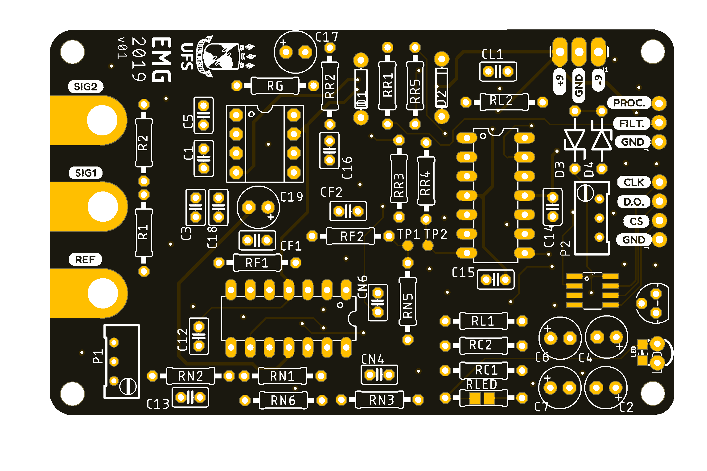

# Muquimetro-SEMG 

## Eletromiografia de Superfície

## Sobre o Projeto

  O Muquímetro é um dispositivo eletrônico que mede a ativação muscular a partir do potencial de ação gerado pelos neurônios motores. A medição ocorre na superfície da pele, por isso o nome Eletromiografia de Superfície (SEMG). A eletromiografia de superfície vem sendo bastante utilizada em diversas áreas, por exemplo, medicina, fisioterapia, robótica, terapia ocupacional. O Muquímetro foi desenvolvido por alunos e professores da Universidade Federal de Sergipe durante a disciplina Eletrônica Aplicada, ofertada pelo curso Engenharia Eletrônica do Departamento de Engenharia Elétrica.

### Aplicações
* Robótica
* Jogos
* Estudo da atividade muscular
* Testes de força, exaustão e fadiga muscular
* Fisioterapia esportiva

## License
Todo o material e o Muquímetro estão licenciados de acordo com TAPR Open Hardware License (OHL). O documento contendo informações a respeito da licença encontra-se no arquivo “LICENSE.pdf”.

## Contact

Jefferson Silveira - descomplexando@gmail.com

Link do Projeto: [https://github.com/jeffsjunior/Muquimetro-SEMG](https://github.com/jeffsjunior/Muquimetro-SEMG)

